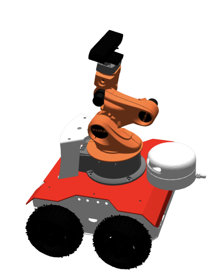
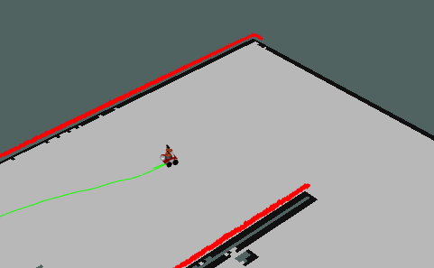
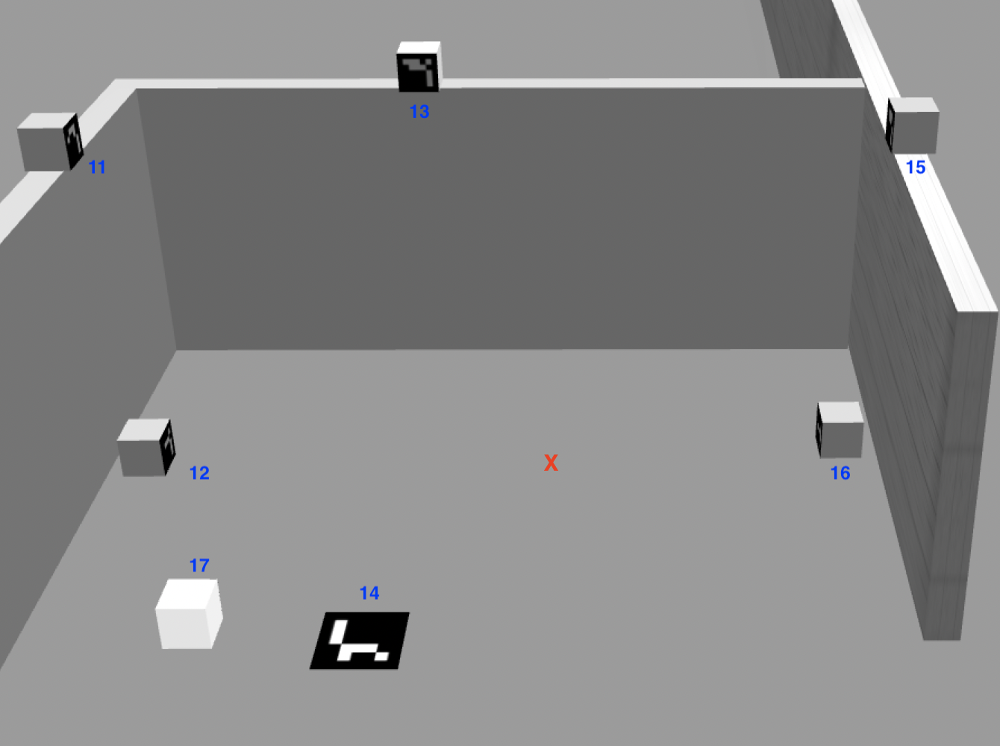

# EXPROBLAB_Assignment #2 

 [Code Documentation](https://mmatteo-hub.github.io/EXPROBLAB_Assignment2/)

##  Introduction
The assignment is the implementation of the previous Assignment architecture, [here](https://github.com/mmatteo-hub/EXPROBLAB_Assignment1) the link, to make the robot move in an environment and have a surveillance behavior. The environment is composed of locations that are connected in a certain way depending on the information given by the environment itself: there are some ArUco markers, in particular 7, deploys in the starting room the robot spawns into. The robot has to detect them and retrieve information relating to the ontology.
The goal is to adopt the Finite State Machine (FSM), with the use of [SMACH](http://wiki.ros.org/smach), implemented in the first assignment that allows the robot to choose the behavior to adopt depending on the situation. The robot is also provided a battery, periodically checked, that needs to be recharged after some time of use. <br>
The locations are divided into:
* room: location with one door;
* corridor: location with at least two doors.

The entities that connect two locations are called _doors_ and the entity that moves in the environment is the robot, called _rosbot_.

##  Folder organization
This repository contains a ROS package named `EXPROBLAB_Assignment1` that includes the following resources.
 - [action/](action/): It contains the definition of each action server used by this software.
    - [Plan.action](action/Plan.action): It defines the goal, feedback and results concerning motion planning.
    - [Control.action](action/Control.action): It defines the goal, feedback and results 
 concerning motion control.
 - [docs/](docs/): It contains the _HTML_ documentation of the package.
 - [images/](images/): It contains the diagrams and images shown in this README file.
 - [launch/](launch/): Contains the configuration to launch this package.
    - [assignment.launch](/launch/assignment.launch)
 - [meshes/](meshes/): a folder containing the meshes for the robot model
 - [msg/](msg/): It contains the message exchanged through ROS topics.
    - [Point.msg](msg/Point.msg): It is the message representing a 2D point.
    - [RoomConnection.msg](msg/RoomConnection.msg): It is the message that describes how the information from the ArUco needs to be processed.
 - [param/](param/): parameters for the robot and the mapping and moving nodes.
 - [scripts/](scripts/): It contains the implementation of each software component.
    - [controller.py](scripts/controller.py): It is a dummy implementation of a motion 
    controller.
    - [fsm.py](scripts/fsm.py):
    - [go_to_location_to_visit.py](scripts/go_to_location_to_visit.py):
    - [helper.py](/scripts/helper.py):
    - [init_state.py](/scripts/init_state.py):
    - [plan_path_to_location.py](scripts/plan_path_to_location.py):
    - [planner.py](scripts/planner.py): It is a dummy implementation of a motion planner.
    - [reasoner.py](scripts/reasoner.py): It is the "brain" of the FSM, responsible for giving the choices to the planner.
    - [recharge.py](scripts/recharge.py): It is the node that monitors the recharge of the robot and brings it to the dedicated room when necessary.
 - [src/](src/): It contains the C++ files
    - [detect_marker.cpp](src/detect_marker.cpp): It is the node responsible for making the arm robot move to detect the ArUco markers.
    - [detect_marker.h](src/detect_marker.h): It is the definition of the class for the marker detection
    - [marker_server.cpp](src/marker_server.cpp): It is the server, already provided, to retrieve the information from the ArUco
 - [srv/](srv/): it contains the .srv files
    - [RoomInformation.srv](msg/RoomInformation.srv): It is the description of the server request and response.
 - [topology/](/topology): It contains the starting ontology used in the package which is modified in the initial state to build the new environment for the assignment.
    - [topological_map.owl](topology/topological_map.owl): topological map from which the environment is built.
 - [urdf](urdf/): It contains the urdf of the robot and its arm, in the dedicated folder.
 - [utilities/EXPROBLAB_Assignment2/](utilities/EXPROBLAB_Assignment2/): It contains auxiliary python files, 
 which are exploited by the files in the `scripts` folder.
    - [name_mapper.py](utilities/EXPROBLAB_Assignment2//name_mapper.py): It contains the name
 of each *node*, *topic*, *server*, *actions* and *parameters* used in this architecture, if any.
 - [worlds/](worlds/): It contains the world definition used.
 - [CMakeLists.txt](CMakeLists.txt): File to configure this package.
 - [README.md](README.md): README of the repo
 - [package.xml](package.xml): File to configure this package.
 - [setup.py](setup.py): File to `import` python modules from the `utilities` folder into the 
 files in the `script` folder. 

##  Software Architecture
For checking the Software Architecture used and the relative components used we re-address to the previous assignment folder:
 - [Software Architecture](https://github.com/mmatteo-hub/EXPROBLAB_Assignment1#-software-architecture)
 - [Software components](https://github.com/mmatteo-hub/EXPROBLAB_Assignment1#-software-components)

The architecture was only re-adapted. In particular, the only component that has been modified is the controller:
 - from the request of the planner it is only taken the last point, the target, which is sent to the *move_base* thus driving there the robot;
 - the controller finishes its execution as soon as the robot reaches the goal.

### Temporal Diagram
The temporal diagram has been a little bit changed according to the new nodes introduced. The resultant one is:

<p align="center">

</p>

The changes are related to:
 - detect_marker with ArUco: this is the initial node of the architecture. In particular it is run and as soon as all the markers are detected it publishes the list on the */topic_list* topic.
 - FSM: the FSM has a subscriber to the topic to wait for the information coming and processe them when available.
 - Controller server: it sends a request to the *move_base* Action Clientto move the robot. It waits until the robot has reached the location chosen by the planner.
 - SLAM: it works in collaboration with the *move_base* and each time the robot is moved the map is updated and save on the server. In this way, with a lot of iteration the path the *move_base* will compute will be more and more accurate.

The same for the surveillance policy adopted and the 
 - [Surveillance Policy](https://github.com/mmatteo-hub/EXPROBLAB_Assignment1#surveillance-policy-adopted)

##  Node for marker detection
The marker detection is performed using the [OpenCV](https://docs.opencv.org/4.x/d5/dae/tutorial_aruco_detection.html) library for the ArUco markers. <br>
The node, [detect_markers.cpp](/src/detect_marker.cpp), is composed of a class responsible of detecting the markers. It uses the RGB-D camera the robot is provided with. The node prints on the terminal the ID detected and it is not ended till the end of the entire program.

##  Mapping
For the mapping solution I used the Gmapping algorithm which is a SLAM (simultaneous localization and mapping) algorithm that allows a robot to create a map of its environment and to simultaneously localize itself within that map. It does this by using sensor data from laser rangefinders or cameras to generate a map and then using that map to determine its own location within the environment. <br>
The Gmapping algorithm uses a filtering approach to map the environment and localize the robot. Specifically, it uses a particle filter to track the robot's pose (i.e., its position and orientation) over time. As the robot moves through the environment, it takes measurements with its sensors and updates the filter using these measurements. The filter maintains a distribution over the possible poses of the robot, and this distribution is updated at each time step based on the sensor measurements and the motion of the robot. By using a filtering approach, the Gmapping algorithm is able to handle uncertainty and noise in the sensor measurements, which is important for reliable operation in real-world environments.

##  Installation and Running Procedure
### Run by `roslaunch` file
In order to run the program by the [`roslaunch`](launch/assignment.launch) file we first need to install the `xterm` tool by following these steps:
```bash
sudo apt-get update
sudo apt-get -y install xterm
```

Now to run the code we just type these on a terminal:
```bash
roslaunch EXPROBLAB_Assignment2 assignment.launch
```

##  Environment
The resultant ontology of the in this assignment is the following:


The environment is built according to the information taken by the robot. <br>
Rooms' name and their coordinates are stored in two different arrays with a one-to-one relationship thus allowing the program to find them easily during the execution.

## Robot
The robot is an assembly of different existing urdf re-adapted to this task. In particular, there are two robots:
 - [ROSbot](https://husarion.com), from which it was taken the entire model
 - [KUKA](https://www.kuka.com/it-it/prodotti-servizi/sistemi-robot/robot-industriali), from which it was only taken the arm.
The resultant robot is the following:

<p align="center">

</p>

Since the original urdf of the two different robots were different in dimensions, then I decided to maintain the ROSbot with its original dimensions and to scale the KUKA such that it is proportional to the entire assembly.

For the robot specifications used check the last assignment section [here](https://github.com/mmatteo-hub/EXPROBLAB_Assignment1#robot). Important to remember that the battery duration is changed and incremented up to 20 minutes because of the low simulation speed during the test. <br>
<br>
The original urdf was modified by changing the position of the camera and the laser. In particular: 
 - the camera, which is a RGB-D one, is placed on the KUKA arm, such that it can be moved from code;
 - the laser has been placed in front of the robot and its range is changed from -90° to 90°.

### Laser of the robot
The initial version of the laser is provided with a view range from -180° to 180°. Since the resultant assembly also provided an arm I had to move the laser and change its view range. This is needed because, otherwise, the robot would have errors while reading them since it would see obstacles that are not: the arm for example.

### Robot behaviour when in a room
Since the robot is supposed to do something when it is in a new just reached room, to perform a complete scan of the room, the execution of the FSM is stopped for a while and the robot arm turns 360°. <br>
In the code there is a variable to monitor the actual robot position in particular:
 - as soon as the detection phase is finished the robot is set in its home configuration: all the joint angles are set to 0 rad whereas joint 1 is set to -3.14 rad;
 - a variable, called *joint1_angle*, is initialized in the [helper.py](/scripts/helper.py) with the value -1;
 - each time the robot is in a new room the variable is changed in sign, by multiplying it by -1, and the angle is set according to it.

In this way, the robot rotation is monitored from code and it will be clockwise or anti-clockwise alternatively.

## Robot view while moving
Here there is a snap of the robot while it is reaching the first goal set by the reasoner and sent by the controller.



In the picture it can be seen:
 - the laser used to detect obstacles;
 - the global path of the robot;
 - the local path of the robot;
 - the map mapped till that moment by the robot.

## ArUco marker
In computer vision, an ArUco marker is a square barcode that is used to identify things specifically. Each marker has a different pattern made up of a series of black and white squares placed in a square grid. Robotics, augmented reality, and other applications use arco markers to swiftly and precisely identify objects. <br>
At the beginning of the program execution, the robot does not anything about the environment and it has to detect some markers to build the ontology. The markers are placed as shown in the figure:



The red X indicates the robot's spawning position. <br>
The robot has to detect them with its camera and then store the value to build the ontology later. <br>
<br>
To perform a scan of the total room the program start by making the arm turn around the base and looking at the ground. In this way, all the ground markers, 12 14 16 17, are correctly detected. Later the same operation is performed with the robot facing to the top of the walls thus detecting 11 13 and 15 markers. Once the monitoring action is finished the robot is put back into its "home" position and the FSM starts.

##  System Features 
The modularity of the architecture already implemented in Assignment #1 allowed me to make very few changes to the existing nodes. I was able to adapt the new node for detecting the marker by just modifying the coordinates passed to the `controller.py`.

##  System Limitation
The marker detection is thought for this environment, so if the marker were placed in a different position the camera could not detect them. <br>
Moreover, the robot is an assembly of two pre-existing ones so when the base is moving the parameters are not optimal for the entire assembly thus having a slow simulation when the robot is moving.

##  Possible technical improvements
- Detection phase: <br>
 A possible improvement could be the possibility to have a monitoring phase as general as possible, thus not having problems in detecting markers put in different locations. Possibility of tuning the parameters to make the robot faster thus avoiding too long simulations. <br>
- Exploration phase: <br>
 There is an algorithm that can be used to make the robot explore a map. In particular, the *Explore-Lite* algorithm provides greedy frontier-based exploration. When the node is running, the robot will greedily explore its environment until no frontiers could be found, by sending goals to the Move Base server
- Planner and Controller: <br>
Implement a planner that takes into account the wall presence and a controller that takes each point planned and drives the robot to the goal through these points. Of course, it would be needed a planning algorithm to make the planner plan all the points correctly.

##  Authors and Contacts
[Matteo Maragliano](https://github.com/mmatteo-hub) (S4636216) <br>
[S4636216@studenti.unige.it](mailto:S4636216@studenti.unige.it)